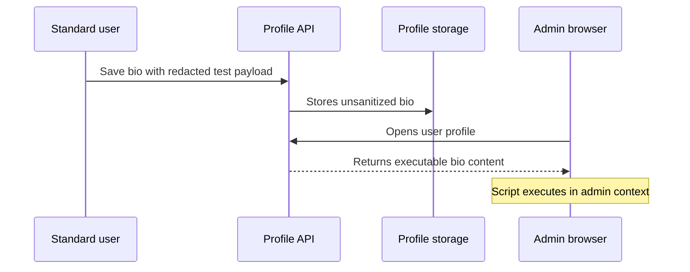

# Report Writer

Use this skill after `triage-verifier` has accepted a finding as `proofed`, or
when the user explicitly asks for a draft report from strong evidence. Prefer
`auto-triage` artifacts when available for human reproduction steps,
screen-recording flow, and screenshots. Reports must be accurate, reproducible,
scoped, redacted, and tailored to the receiving program. Do not submit or imply
certainty for unverified findings.

## Current Program Conventions

Modern vulnerability programs converge on these expectations:

- Program policy beats generic guidance. Confirm scope, safe harbor, prohibited
  testing, disclosure rules, custom fields, and allowed communication channels.
- A report must show the vulnerability, exact reproduction, and real impact.
  Avoid speculative impact, invented endpoints, scanner-only evidence, and
  unattached video-only proof.
- AI-assisted reports still require human validation and accountability. Do not
  include unverifiable agent claims.
- Severity is context-sensitive. Use platform taxonomy when required:
  Bugcrowd VRT/P-rating, HackerOne program severity/CVSS, GitHub advisory
  severity/CVSS/CWE/affected versions, or the program's custom scale.
- CVSS v4 should include score plus vector when used. Base score is a baseline;
  Threat and Environmental context should be named when they drive priority.
- Attach artifacts directly when the platform expects it. Do not link private
  videos or external proof material if that would expose undisclosed details.
- Keep private program details, customer data, secrets, tokens, PII, and exploit
  payloads confidential unless the program explicitly permits disclosure.

## Report Types

Choose one primary type:

- Bounty submission: concise title, asset, weakness, severity rationale, steps,
  expected/actual behavior, impact, evidence, remediation, and attachments.
- Coordinated disclosure: affected products/versions, vendor status, timeline,
  CVE/CWE/CVSS metadata, mitigation, credit, and publication constraints.
- GitHub advisory draft: package/ecosystem, affected ranges, patched versions,
  severity, CWE, CVSS vector, vulnerable functions, workarounds, and references.
- Internal triage report: finding ID, proof packet, business impact, owner,
  reproduction, environment, fix guidance, regression tests, and residual risk.
- Chain report: component findings, precondition/postcondition diagram,
  end-to-end proof, negative controls, escalated impact, and de-escalation notes.

## Helper Scripts

Create a report scaffold:

```bash
python3 <skill-dir>/scripts/report_template.py \
  --finding-id F-0007 \
  --title "Stored XSS in profile bio executes for tenant admins" \
  --target "app.example.com" \
  --platform hackerone \
  --weakness "CWE-79: Cross-site Scripting" \
  --severity high \
  --summary "A standard user can store script in profile bio viewed by admins." \
  --impact "Admin session actions may be performed in the victim browser." \
  --proof-ref "data/triage-verifier/F-0007-proof.md" \
  --diagram "data/reports/F-0007-flow.png" \
  --attachment "redacted request/response pair" \
  --remediation "Sanitize profile bio on write and encode on render."
```

Render a Mermaid diagram to SVG or PNG for report attachments:

```bash
python3 <skill-dir>/scripts/render_mermaid.py \
  --input data/reports/F-0007-flow.mmd \
  --output data/reports/F-0007-flow.png \
  --theme neutral \
  --background white
```

The renderer prefers `mmdc` from Mermaid CLI. If `mmdc` is unavailable and
network/tooling policy allows package download, pass `--allow-npx` to run
`npx -y @mermaid-js/mermaid-cli`. Keep the `.mmd` source beside the rendered
image so the diagram is reviewable and diffable.

## Workflow

1. Load the finding from `finding-tracker`. Prefer `proofed`; if not proofed,
   label the draft clearly as unsubmitted/internal and identify proof gaps.
2. Load proof material: `triage-verifier` packet, `auto-triage` package,
   exploit-chain packet, screenshots, request/response pairs, logs, crash
   traces, minimized inputs, code lines, CVE research, and affected-version
   evidence.
3. Read the program brief or target policy. Capture scope, asset, accepted
   impacts, severity method, disclosure rule, attachments rule, and custom
   fields.
4. Decide the recipient format: HackerOne, Bugcrowd, GitHub advisory,
   coordinated disclosure, internal report, or chain report.
5. Write a strong title: vulnerability class + affected function/asset + impact.
6. Summarize in one short paragraph. State actor, precondition, primitive, and
   impact without hype.
7. Write deterministic reproduction steps. Prefer the `auto-triage` human
   flow when available. Include accounts/roles, URLs, versions/builds, commands,
   request bodies, expected vs actual behavior, screenshots, and cleanup.
8. Explain impact with evidence. Connect the proof to confidentiality,
   integrity, availability, authorization, tenant, account, business, safety, or
   supply-chain boundaries.
9. Add severity rationale. Name the platform taxonomy, CVSS vector, VRT class,
   exploit-chain escalation, compensating controls, and uncertainty.
10. Add remediation. Prefer fix direction, defense-in-depth, regression tests,
    and detection/monitoring when useful.
11. Add visuals only when they clarify the report. Use Mermaid for flows,
    trust boundaries, sequence diagrams, exploit chains, and before/after fix
    diagrams. Render to image for attachments.
12. Redact and final-check before handoff. Remove secrets, cookies, raw customer
    data, unnecessary exploit code, private program names in public drafts, and
    unsafe automation details.

## Mermaid Diagrams

Use diagrams to reduce triage friction, not to decorate the report.

Good report diagrams:

- Trust-boundary flow: actor -> frontend -> API -> service -> datastore.
- Sequence diagram: role A action, server decision, role B impact.
- Exploit-chain graph: finding IDs, preconditions, postconditions, blockers.
- Patch comparison: vulnerable path vs fixed guard.
- Data exposure map: exact data class and tenant/account boundary crossed.
- Project NapTime-style explanatory chart: compact agent/tool/evidence loop or
  vulnerability state transition that makes complex research steps readable.

Keep diagrams small enough to read in a report. Use stable IDs and plain labels.
Avoid overly dense charts, icons, gradients, or visual claims not proven by the
report. Always keep the Mermaid source file and mention rendered image paths in
the report.

Example:



## Required Sections

Include these unless the platform template already collects them separately:

- Title
- Summary
- Program/asset/scope
- Vulnerability class and weakness ID when known
- Affected product, version, build, package, endpoint, function, binary, or
  commit
- Preconditions and attacker role
- Steps to reproduce
- Expected behavior
- Actual behavior
- Impact and affected boundary
- Evidence and attachments
- Severity rationale
- Remediation and regression tests
- Disclosure constraints and redaction notes

For GitHub/CVE-style advisories, also include affected ranges, patched versions,
workarounds, references, credit, CVE/GHSA IDs when assigned, CWE, CVSS score and
vector, and package ecosystem.

## Quality Bar

Before finalizing, check:

- A triager can reproduce or understand the proof without asking for missing
  setup.
- Human PoC steps and screenshots come from `auto-triage` when that package
  exists, while proof claims still trace back to `triage-verifier`.
- The report shows why the issue is security-relevant, not merely unusual
  behavior.
- The strongest impact is supported by evidence and does not exceed scope.
- Negative controls or mitigations are included when they matter.
- Attachments are local, direct, redacted, and named in the report.
- Diagrams match the proof and render successfully.
- Severity claims separate baseline technical severity from environment-specific
  risk.
- The report does not disclose private program details outside allowed channels.

## Output Format

```text
Report: <path>
Finding: <ID and title>
Recipient format: <HackerOne / Bugcrowd / GitHub advisory / disclosure / internal>
Severity: <rating and rationale source>
Attachments: <paths or pending artifacts>
Diagrams: <Mermaid source and rendered image paths>
Submission readiness: <ready / needs proof / needs redaction / needs program fields>
Remaining gaps: <none or exact fields>
```

## Handoff

Use `finding-tracker` for state and proof references, `triage-verifier` for
proof quality, `auto-triage` for human-operated PoC packages and screenshots,
`exploit-chain-analysis` for chain diagrams and chain impact, `cve-research` for
advisory/CVE metadata, and `engagement-scope` for program policy and disclosure
constraints.
